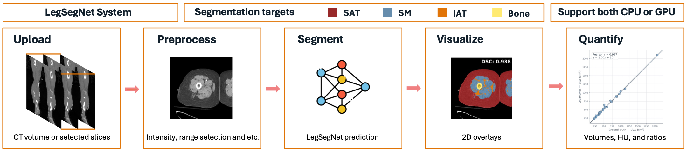
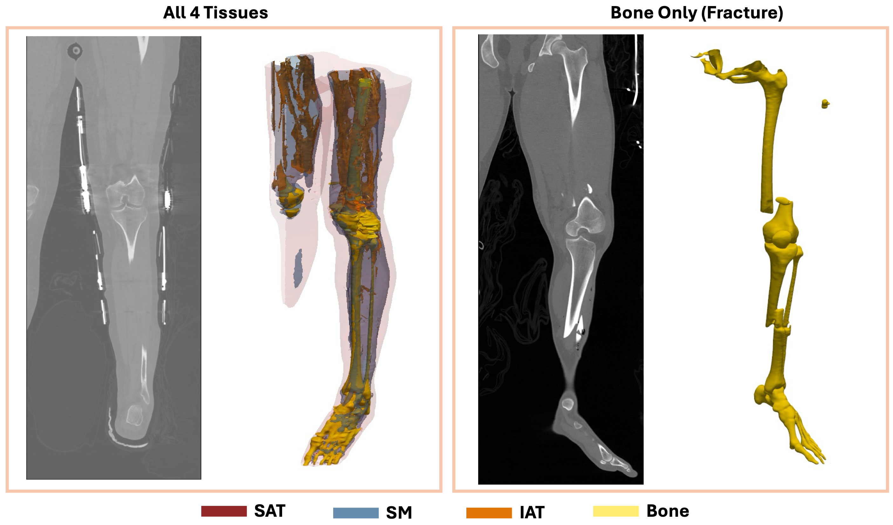

# LegSegNet

LegSegNet is a local Gradio app for lower-extremity CT tissue segmentation and body composition analysis. It uses a pretrained 2D nnU-Net model to segment four tissue compartments:

- **SAT**: subcutaneous adipose tissue
- **SM**: skeletal muscle
- **IAT**: inter/intramuscular adipose tissue
- **Bone**

LegSegNet is designed for a practical workflow: upload a CT slice or NIfTI volume, run segmentation locally, and export masks and quantitative tissue measurements.

## System Overview

The full LegSegNet workflow takes lower extremity CT scans as input, predicts tissue masks, and produces visual and quantitative outputs for downstream analysis.



## 3D Construction

The 3D view shows volumetric reconstruction of LegSegNet predictions. The system overview summarizes how the app connects CT input, segmentation, visualization, and body composition measurements.



## Run

Install the dependencies and run:

```bash
pip install -r requirements.txt
python app.py
```

The app automatically detects whether CUDA is available. With a GPU, it uses the full inference settings with mirroring and 0.5 tile overlap. On CPU, it disables mirroring and uses `tile_step_size=1.0`, which is faster but may slightly reduce accuracy.

## 2D Slice Inference

Use the **Single Slice (PNG)** tab for one 2D CT slice.

The input PNG should be:

1. HU-windowed to `[-200, 200]`
2. linearly rescaled to `[0, 255]` as 8-bit grayscale

The app accepts different image sizes and resizes the slice to `256 x 256` before inference.

Outputs:

- colored segmentation overlay
- downloadable mask PNG
- per-class pixel counts

## 3D Volume Inference

Use the **3D Volume (NIfTI)** tab for `.nii` or `.nii.gz` CT volumes.

The system:

1. loads the volume and creates a coronal preview of the legs
2. lets you click two points to choose the axial range
3. runs slice-by-slice nnUNet inference on the selected range
4. returns an overlay grid, body composition measurements, and a downloadable 3D mask NIfTI

For volume inputs, LegSegNet reports tissue volume and mean CT attenuation for SAT, SM, IAT, and bone. It also computes derived measurements such as total fat volume, IAT-to-SAT ratio, and muscle-to-fat ratio.

## Model Weights

The LegSegNet model is available at: [LegSegNet weights](https://huggingface.co/GogoChen/LegSegNet)

Download following files and put them under `model` folder as follow:

```text
model/
|-- plans.json
|-- dataset.json
|-- fold_0/
    |-- checkpoint_best.pth
```

If your model files are stored somewhere else, update `MODEL_FOLDER` in `inference.py`.

## Citation

If you find LegSegNet useful, please cite the manuscript:

## License

